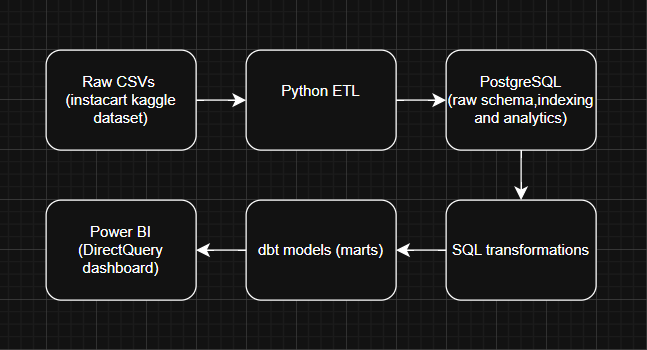
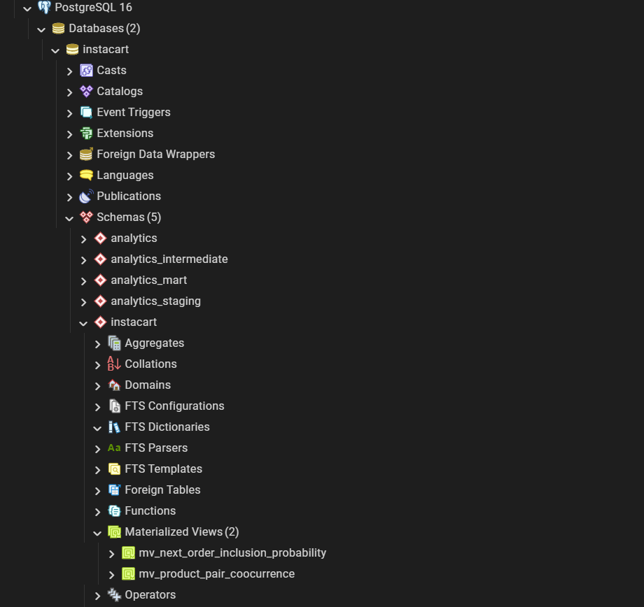
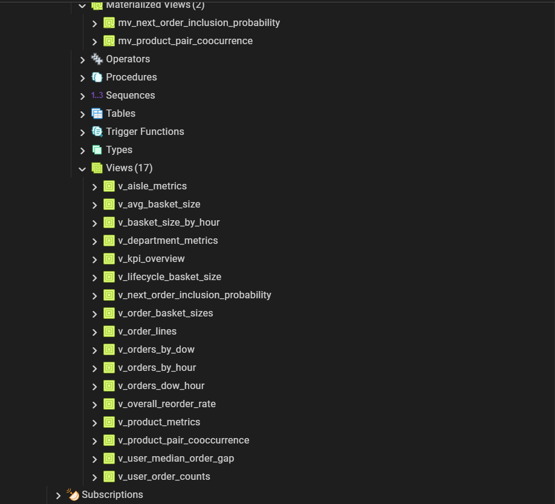
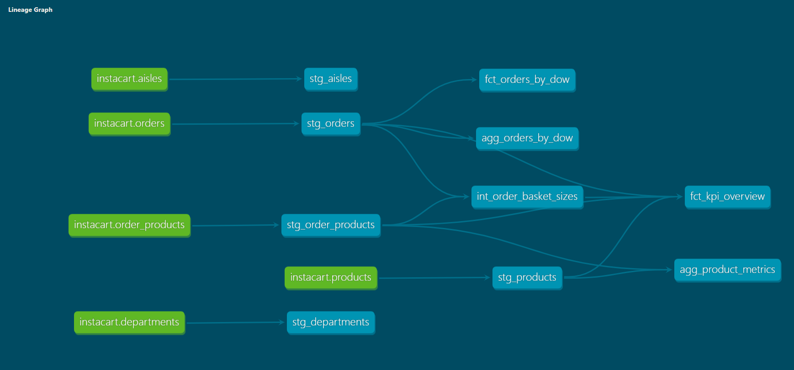
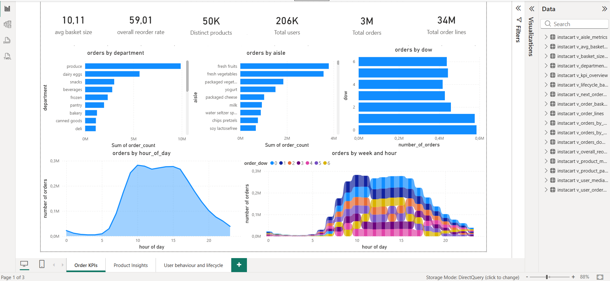
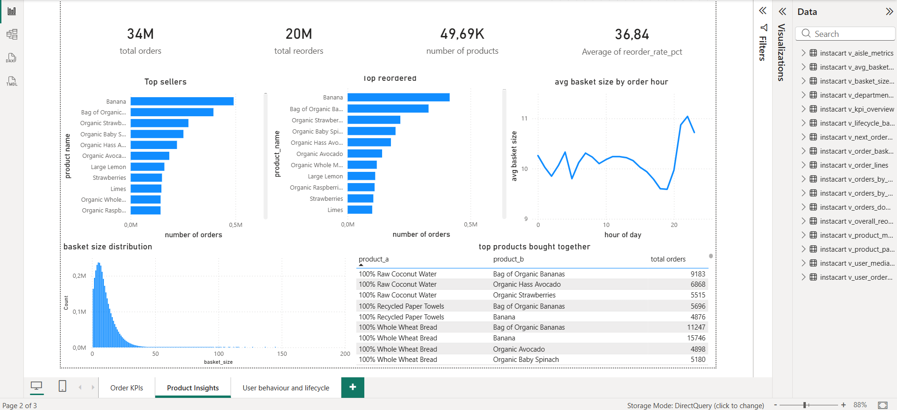
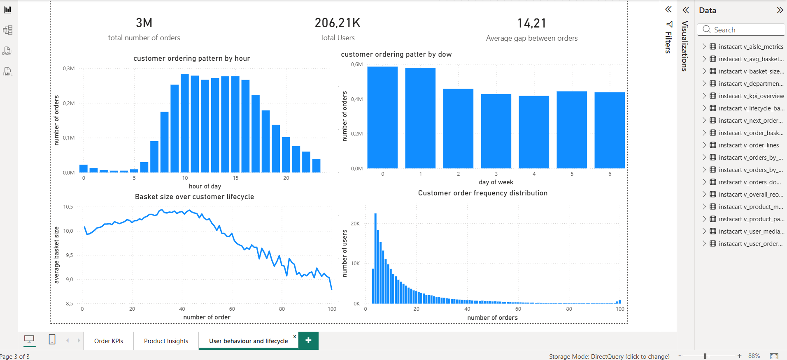

---

# 📦 Instacart Retail Data Warehouse & Analytics Engineering Pipeline

**Built from scratch: PostgreSQL, SQL, dbt, and Power BI (DirectQuery on 3M+ rows).**

---

## 🚀 Project Purpose

To engineer a retail data warehouse and analytics pipeline—designing every layer (raw, staging, intermediate, marts) from scratch in PostgreSQL, modeling them in dbt Core, and delivering a live Power BI dashboard via DirectQuery.

---

## 🏗️ Architecture Overview

---

## 📊 Dataset

This project uses the public **Instacart Online Grocery Shopping 2017** dataset from Kaggle (3M+ rows of orders, products, and baskets).

---

## 🛠️ Tech Stack

* **Python**: Data loading and preprocessing
* **PostgreSQL**: Data warehouse, schemas, indexing, materialized views,
* **SQL**: Transformation logic, KPI calculations.
* **dbt Core**: Staging, intermediate, and mart models
* **Power BI**: DirectQuery dashboards on 3M+ rows
* **Git**: Version control (~70 commits)

---

## 🗄️ 1. Data Warehouse Design

Engineered a complete warehouse architecture in PostgreSQL with raw, staging, intermediate, and mart layers.
Manually designed schemas, implemented primary/foreign keys, and created materialized views for performance.

---

## 🔄 2. SQL Transformations & Optimization

All business logic was crafted in SQL, including joins, KPIs, and aggregations. Optimized performance with indexing and materialized views before layering dbt on top.

---

## 🧱 3. dbt Modeling

After validating SQL logic, all transformations were modeled in dbt. Developed staging, intermediate, and mart layers with full lineage documentation.dbt/README.md for further references.

---

## 📊 4. Power BI Dashboard (DirectQuery)

Built a 3-page Power BI dashboard connected live via DirectQuery to handle 3M+ rows in real-time. Showcased order KPIs, product insights, and user behavior without import mode. performance screenshots are available in images folder.

---

## 📂 Repository Structure

Retail_Analytics_Engineering_Pipeline/
├── dashboards/
│   ├── dashboard.pbix
│   ├── dashboard.pdf
│   ├── dashboard_1.png
│   ├── dashboard_2.png
│   └── dashboard_3.png
│
├── data_raw/
│   ├── aisles.csv
│   ├── departments.csv
│   ├── orders.csv
│   ├── order_products__prior.csv
│   ├── order_products__train.csv
│   └── products.csv
│
├── data_clean/
│   ├── aisles.csv
│   ├── departments.csv
│   ├── orders.csv
│   ├── order_products.csv
│   └── products.csv
│
├── dbt/
│   ├── dbt_project.yml
│   ├── profiles.yml
│   ├── models/
│   │   ├── staging/
│   │   │   ├── stg_aisles.sql
│   │   │   ├── stg_departments.sql
│   │   │   ├── stg_orders.sql
│   │   │   ├── stg_order_products.sql
│   │   │   └── stg_products.sql
│   │   ├── intermediate/
│   │   │   └── int_order_basket_sizes.sql
│   │   └── mart/
│   │       ├── agg_orders_by_dow.sql
│   │       ├── agg_product_metrics.sql
│   │       ├── fct_kpi_overview.sql
│   │       └── fct_orders_by_dow.sql
│   └── sources.yml
│
├── images/
│   ├── architecture.png
│   ├── dbt_graph.png
│   ├── schema.png
│   └── views_and_mvs.png
│
├── notebooks/
│   ├── 01_explore_raw.ipynb
│   ├── 02_clean_transform.ipynb
│   └── 03_load_to_postgres.ipynb
│
├── sql/
│   ├── 01_schema.sql
│   ├── 02_test_load.sql
│   ├── 03_indexes.sql
│   ├── 04_analytics_queries.sql
│   ├── 05_views.sql
│   ├── 06_materialized_views.sql
│   └── 07_metric_views.sql
│
└── ETL_RUN_LOG.md

---

## 📝 How to Run Locally

1. Clone the repo and set up the Python environment.
2. Run ETL notebooks to load data into PostgreSQL.
3. Execute dbt models.
4. Open Power BI and connect via DirectQuery.

---

## 🔧 Future Improvements

* Add dbt tests (uniqueness, relationships)
* Deploy dbt to a scheduler like Airflow
* Add incremental models for larger datasets

---

## 👤 Author

Raga, Aspiring Analytics Engineer | Berlin, Germany

---
